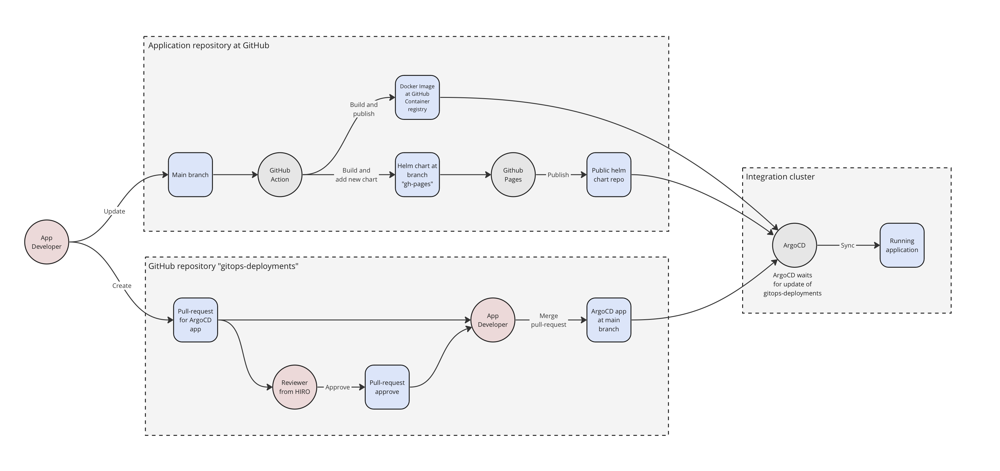

# GitOps Deployments

This repository contains GitOps definitions for GLACIATION project. At the moment it defines Integration cluster only, but later it may be extended with other and environments.

The diagram shows how CI/CD works in GLACIATION project. Circles  are actors and rounded squares are artifacts. 

A reference example of application repository is [glaciation-metadata-service](https://github.com/glaciation-heu/glaciation-metadata-service).